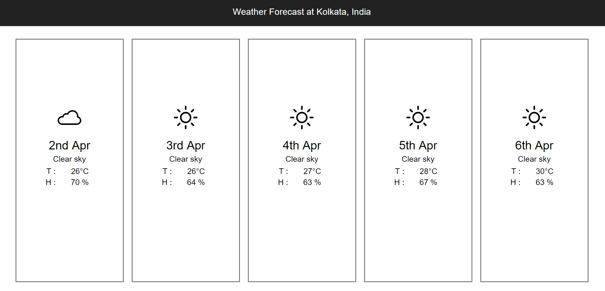

Weather App
-------------
Hosted at https://weathery.netlify.com

Initial view

Expanded view (after clicking on any day)

Future scope
------------
1.Responsive text size and horizontal layout for mobile.
2.Add tests for components
3.More Summary data in single day view
4.Let user choose location

Install
--------
`npm i`

Installs all dependencies locally.

Test
-----
`npm test`

Launches the test runner in the interactive watch mode.

Running the app
---------------
`npm start`

Runs the app in the development mode.
Open http://localhost:3000 to view it in the browser.

`npm run build`

Builds the app for production to the build folder.
It correctly bundles React in production mode and optimizes the build for the best performance.
The build is minified and the filenames include the hashes.

To host the build folder, host it with a server with `/*` redirected to `index.html` (for routing to work correctly).
To see it in action right now, please visit https://weathery.netlify.com.
